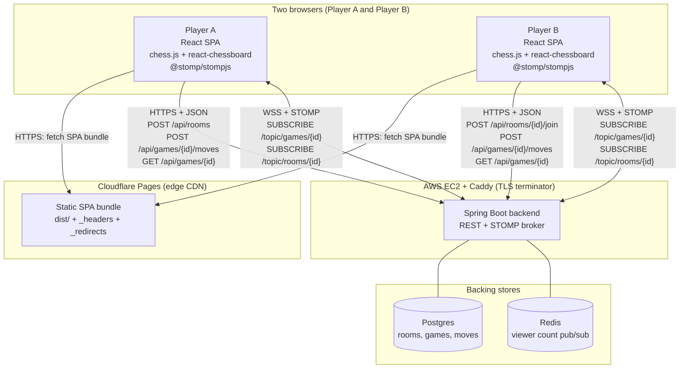

# Chess Room

Online multiplayer chess. Share a room link, play live, see moves and
status broadcast in real time.

## Overview

`chess-frontend` is a React + TypeScript single-page app that pairs two
browsers through a server-authoritative chess engine. One player creates
a room, the other joins via the shared link, and from there the board,
clock-free turn flow, and terminal status (checkmate, stalemate, draw,
abandoned) come from the backend over REST plus STOMP-over-WebSocket.
`chess.js` lives in the browser only to highlight legal squares and to
make the optimistic-update path feel snappy — the server is the source
of truth.

The companion API lives in
[`chess-backend-java`](https://github.com/dariogguillen/chess-backend-java):
Spring Boot, Postgres for game state, Redis for the viewer-count
broadcaster. The two repos coordinate through an OpenAPI snapshot
(committed at `openapi.json` in this repo) and a small set of
hand-typed STOMP wire shapes (`src/api/wsEvents.ts`). The project is
a portfolio piece: engineering quality, accessibility, performance
discipline, and the agent harness driving every feature are the point,
not the feature count.

## Live demo

- **Frontend** — <https://chess-frontend-52i.pages.dev/>
- **Backend repo** — <https://github.com/dariogguillen/chess-backend-java>
- **OpenAPI (Swagger UI)** — <https://chess-backend.duckdns.org/swagger-ui.html>
- **OpenAPI (JSON)** — <https://chess-backend.duckdns.org/v3/api-docs>

The backend runs on AWS Free Tier and may briefly be down for unrelated
reasons; the frontend deploys independently and degrades to an error
message on the first failed API call.

## Architecture



Three traffic paths sit behind the diagram:

1. **Bundle fetch (HTTPS).** Browsers pull the static SPA from
   Cloudflare's edge. Cloudflare serves `dist/` byte-for-byte, applies
   the headers from `public/_headers` (HSTS, `X-Content-Type-Options`,
   `X-Frame-Options`, `Referrer-Policy`), and falls back any unmatched
   route to `index.html` via `public/_redirects` so client-side routing
   resolves correctly on refresh.
2. **REST (HTTPS + JSON).** Room and game lifecycle — create, join,
   submit move, fetch state. The frontend's typed client wraps an
   `openapi-fetch` instance whose paths are generated from
   `openapi.json` into `src/api/generated/schema.ts`; the wrappers in
   `src/api/rooms.ts` and `src/api/games.ts` translate
   `{ data, error }` tuples into thrown `ApiError` values for React
   consumers.
3. **STOMP over WebSocket (WSS).** Live updates. Each Play page mounts
   a STOMP client and subscribes to `/topic/games/{gameId}` for opponent
   moves and `/topic/games/{gameId}/viewers` for the viewer counter.
   While Player A waits for a second player, a short-lived second
   STOMP client subscribes to `/topic/rooms/{roomId}` and races against
   a one-shot `GET /api/rooms/{id}` to discover the game id as soon as
   it exists.

Deeper detail (REST contract, STOMP topic shapes, the optimistic-update
pattern, the self-filter for own-move broadcasts) lives in
[`docs/architecture.md`](./docs/architecture.md).

## Stack

- **Language & UI** — TypeScript 6 strict, React 19, MUI 6 + Emotion,
  Inter via `@fontsource/inter`.
- **Build** — Vite 8. Static SPA. Code-split per route via `React.lazy`.
- **Routing & state** — `react-router-dom` v7 data router, React
  Context for shared identity, `useReducer`/`useState` locally. No
  global store library.
- **Chess** — `chess.js` for local legal-move probing,
  `react-chessboard` v5 for the board UI. Server is authoritative for
  legality and terminal status.
- **Wire formats** — REST typed end-to-end via `openapi-typescript`
  against a committed `openapi.json`; STOMP frames hand-typed in
  `src/api/wsEvents.ts` because WebSockets are out of the OpenAPI
  surface.
- **Testing** — Vitest + React Testing Library (component / hook /
  utility), MSW for HTTP interception, Playwright for end-to-end against
  the production bundle with REST and STOMP both mocked.
- **Hosting** — Cloudflare Pages (production + per-PR preview
  deployments). Backend on AWS EC2 behind Caddy.

## Quick start

```bash
git clone https://github.com/dariogguillen/chess-frontend.git
cd chess-frontend
nvm use            # picks Node 20.19+ from .nvmrc
npm ci             # honours .npmrc: ignore-scripts, min-release-age
npm run dev        # http://localhost:5173
```

The dev server is configured to proxy `/api/*` and `/ws` to
`http://localhost:8080` so it works against a locally-running
[`chess-backend-java`](https://github.com/dariogguillen/chess-backend-java)
without a CORS detour. To point at the deployed backend instead, set
`VITE_BACKEND_URL=https://chess-backend.duckdns.org` in a `.env.local`
file before `npm run dev`.

Verify everything (lint, format, typecheck, tests, build, audit) with:

```bash
./init.sh
```

A green `./init.sh` is the only acceptable evidence that a feature is
done.

## Engineering process (the harness)

This repo is driven by a small set of agent role definitions and a
disk-resident state machine, not by chat memory. Every feature is
planned, implemented, reviewed, and recorded on disk before it can flip
to `done`. The portfolio differentiator is not the chess game — it is
the harness that built it.

The load-bearing files:

- [`CLAUDE.md`](./CLAUDE.md) — pins the active agent role at session
  start and the read order for context files.
- [`AGENTS.md`](./AGENTS.md) — project map: where things live, how the
  workflow runs, the stack summary.
- [`feature_list.json`](./feature_list.json) — the full backlog with
  status, priority, and acceptance criteria for every feature.
- [`progress/`](./progress/) — `current.md` (active plan) and
  `history.md` (append-only session log). State outlives chat.
- [`CHECKPOINTS.md`](./CHECKPOINTS.md) — definition of done. The
  reviewer walks this list and rejects features that miss any item.
- [`.claude/agents/`](./.claude/agents/) — role definitions for
  `leader`, `implementer`, `reviewer`, and `ui-reviewer`.
- [`notes/`](./notes/) — per-feature learning notes, one per shipped
  feature, written for a reader fluent in Scala/Typelevel who is going
  deep on React/TypeScript.

The discipline is the "verification before completion" rule paraphrased
from [obra/superpowers](https://github.com/obra/superpowers): no
completion claims without fresh evidence from `./init.sh`. The reviewer
runs it independently; CI runs the Playwright tier in its own workflow
on every PR.

## Hosting

The production SPA is served by [Cloudflare Pages](https://pages.cloudflare.com).
Cloudflare's GitHub integration uploads `dist/` on every push to `main`
and on every pull request, so the reviewer can click a preview URL from
the PR check (`https://<commit-hash>.chess-frontend.pages.dev`) instead
of cloning the branch. The backend URL lives in the Cloudflare dashboard
as `VITE_BACKEND_URL` and is inlined by Vite at build time. The full
hosting decision (Cloudflare vs Vercel vs staying on GitHub Pages, the
deferred `wrangler.toml`, the CSP carry-over, the npm-version env-var
workaround) lives in [`docs/architecture.md`](./docs/architecture.md#hosting).

### Brave browser users

The backend uses STOMP over a WebSocket
(`wss://chess-backend.duckdns.org/ws`). Brave's Shields treats
cross-origin WebSockets as a fingerprinting vector and blocks them by
default. Symptom: the page loads but real-time updates never arrive —
your moves work locally, the opponent never sees them, and you never
see theirs.

Workaround: lower Shields for this site (click the lion icon → "Shields
are UP" → toggle off), or use Firefox / Chromium / Safari.

## Testing

### Unit and component (Vitest + RTL)

```bash
npm test            # one-shot
npm run test:watch  # watch mode
```

Tests are co-located with their subjects (`Foo.tsx` + `Foo.test.tsx`).
HTTP is intercepted with MSW at the network layer. STOMP is intercepted
at the module seam via a typed `MockStompClient`. The full suite is 137
specs and runs in seconds.

### End-to-end (Playwright)

```bash
npm run test:e2e         # headless Chromium
npm run test:e2e:headed  # see the browser
npm run test:e2e:ui      # Playwright interactive UI
npm run test:e2e:report  # open the last HTML report
```

Specs live in `e2e/` and exercise the production bundle via
`vite preview`. The backend is mocked at the network layer
(`page.route` for REST, `page.routeWebSocket` for STOMP) so the tier is
hermetic and does not need a running `chess-backend-java`. `./init.sh`
skips Playwright by default; opt in with `RUN_E2E=true ./init.sh`. CI
runs the suite on every PR via
[`.github/workflows/e2e.yml`](./.github/workflows/e2e.yml).

### Manual two-browser smoke (against a local backend)

For a real STOMP loop against a live backend, see
[`docs/local-e2e.md`](./docs/local-e2e.md). The Vite dev server proxies
`/api/*` and `/ws` to `http://localhost:8080` so the frontend talks
same-origin and CORS stays out of the picture.

## Supply chain hygiene

The npm dependency surface is hardened by policy, not by trust. The
project-level `.npmrc` sets `ignore-scripts=true`, `engine-strict=true`,
`min-release-age=7`, and `legacy-peer-deps=true` so that no
`postinstall` script runs at install time, every contributor stays on
the Node 20.19+ / npm 11.7+ floor, and freshly-published versions are
kept out of the tree during the typical detection window for
compromised publications. `./init.sh` rebuilds the allowlisted
`esbuild` binary explicitly and fails the build on any `npm audit`
finding at moderate severity or higher. The full rationale, the audit
threshold, and the allowlist procedure live in
[`docs/conventions.md`](./docs/conventions.md#supply-chain-hygiene).

## Documentation

- [`docs/architecture.md`](./docs/architecture.md) — stack, layering,
  REST and STOMP contracts, hosting decision, end-to-end testing
  strategy.
- [`docs/conventions.md`](./docs/conventions.md) — code style, hooks
  discipline, TypeScript discipline, supply chain policy.
- [`docs/local-e2e.md`](./docs/local-e2e.md) — manual two-browser
  smoke runbook against a local backend.
- [`notes/`](./notes/) — one learning note per shipped feature,
  written for a Scala/Typelevel reader.

## License

[MIT](./LICENSE).
